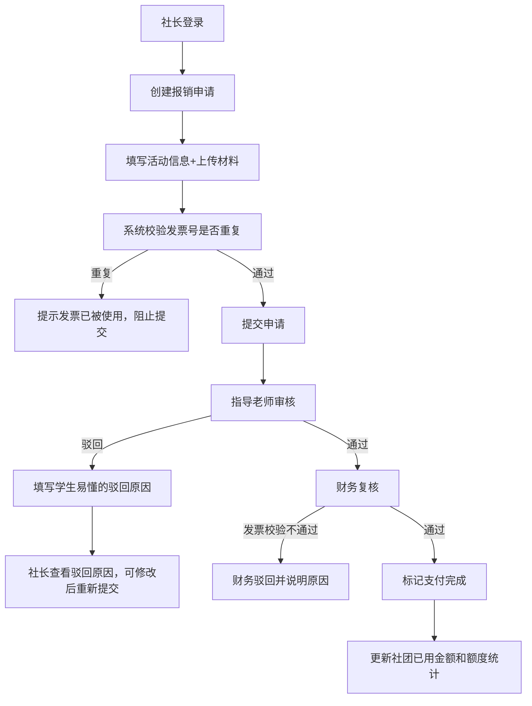

## 1. 产品概述

校园社团经费报销门户系统，面向高校社团管理场景，解决社团经费报销流程繁琐、审批效率低、经费统计不透明等问题。

- 目标用户：社团社长、指导老师、学校财务人员
- 核心价值：规范报销流程、防止重复报销、实时统计经费使用情况

## 2. 核心功能

### 2.1 用户角色

| 角色 | 登录方式 | 核心权限 |
|------|---------|---------|
| 社长（学生） | 账号密码登录 | 创建报销申请、上传预算/发票/付款截图、查看申请状态、查看本社团经费统计 |
| 指导老师 | 账号密码登录 | 审核报销申请、填写驳回原因、查看所指导社团的报销记录 |
| 财务人员 | 账号密码登录 | 复核报销申请、标记支付状态、查看所有社团经费统计、管理发票去重 |

### 2.2 功能模块

1. **登录页**：角色选择登录、身份验证
2. **社长仪表盘**：经费概览、报销申请列表、新建报销入口
3. **报销申请页**：填写活动信息、上传预算表、上传发票、上传付款截图、提交申请
4. **指导老师审核页**：待审申请列表、审核详情、通过/驳回操作
5. **财务复核页**：待复核列表、发票去重校验、支付标记、驳回操作
6. **经费统计页**：社团额度、已用金额、待支付金额、报销明细

### 2.3 页面详情

| 页面名称 | 模块名称 | 功能描述 |
|---------|---------|---------|
| 登录页 | 角色选择卡片 | 三种角色卡片切换，显示对应角色说明 |
| 登录页 | 登录表单 | 账号密码输入、记住登录、登录按钮 |
| 社长仪表盘 | 经费统计卡片 | 显示本学期额度、已用金额、剩余额度、待支付金额 |
| 社长仪表盘 | 申请列表 | 按状态分类展示（待审核/审核中/已通过/已驳回/已支付） |
| 社长仪表盘 | 新建申请按钮 | 快捷跳转到报销申请页 |
| 报销申请页 | 活动信息表单 | 活动名称、活动日期、活动说明、申请金额 |
| 报销申请页 | 文件上传区 | 预算表、多张发票、付款截图上传预览 |
| 报销申请页 | 发票去重提示 | 实时检查发票号是否已被使用 |
| 报销申请页 | 提交按钮 | 提交申请并进入指导老师审核流程 |
| 审核详情页 | 申请信息展示 | 完整展示活动信息、上传的文件 |
| 审核详情页 | 审核操作 | 通过按钮、驳回按钮（驳回需填写学生可读的原因） |
| 经费统计页 | 统计概览 | 各社团额度使用进度条、总览数据 |
| 经费统计页 | 社团明细 | 点击查看社团所有报销记录和支付状态 |

## 3. 核心流程

社长登录后创建报销申请，填写活动信息并上传预算表、发票、付款截图。系统自动校验发票号是否重复。提交后进入指导老师审核环节，老师可通过或驳回（驳回需填写易懂的原因）。通过后进入财务复核，财务再次校验发票去重并最终确认支付。全程可查看各社团的额度、已用金额和待支付款项。

## 4. 用户界面设计

### 4.1 设计风格

- 主色调：学术蓝（#1E40AF）作为主色，搭配清新的薄荷绿（#059669）作为通过状态色，暖橙（#EA580C）作为待审核状态色，暖红（#DC2626）作为驳回色
- 按钮风格：圆角8px，带轻微阴影，hover有缩放和加深效果
- 字体：标题使用"Noto Serif SC"（学术感），正文使用"Noto Sans SC"（易读性）
- 布局风格：左侧导航栏 + 顶部面包屑 + 主内容区卡片式布局
- 图标风格：使用lucide-react线性图标，统一20px尺寸

### 4.2 页面设计概览

| 页面名称 | 模块名称 | UI元素 |
|---------|---------|--------|
| 登录页 | 角色选择卡片 | 三张渐变卡片（蓝/绿/紫），选中态有发光边框，点击切换显示对应登录表单 |
| 登录页 | 登录表单 | 毛玻璃背景效果，输入框有focus光晕，按钮带渐变动画 |
| 社长仪表盘 | 经费统计卡片 | 四个统计卡片带微渐变和图标，进度条使用平滑动画填充 |
| 社长仪表盘 | 申请列表 | Tab切换不同状态，每行申请显示状态徽章（彩色圆角） |
| 报销申请页 | 表单区域 | 分区展示，上传区域有虚线边框和拖拽反馈 |
| 审核详情页 | 文件预览区 | 文件缩略图网格，点击放大预览 |
| 审核详情页 | 驳回原因输入 | 大文本框，附带提示语"请用通俗易懂的语言说明驳回原因，方便学生理解修改" |
| 经费统计页 | 进度条 | 每个社团一条横向进度条，悬停显示具体数字 |

### 4.3 响应式

- 桌面端优先设计（1440px基准）
- 平板端（1024px）：导航栏折叠为抽屉
- 移动端（768px）：统计卡片改为2列，申请列表改为单列卡片堆叠
- 所有交互元素最小触控区域44px

