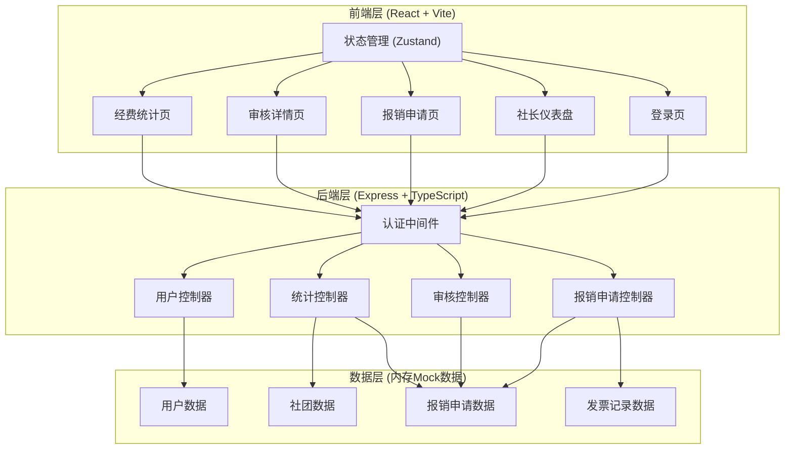
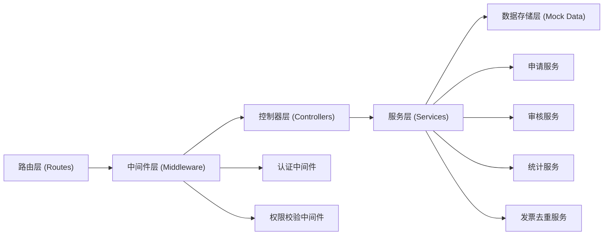
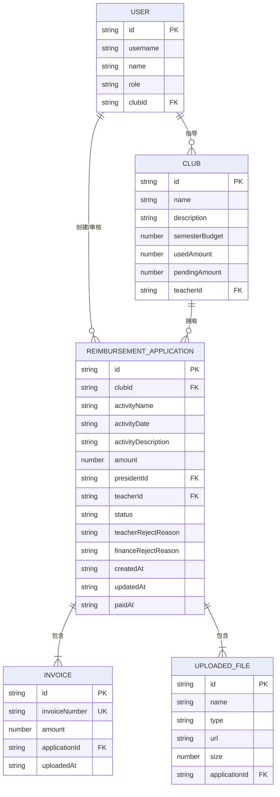

## 1. 架构设计



## 2. 技术描述

- 前端：React@18 + TypeScript + Vite + TailwindCSS@3 + Zustand + React Router DOM + Lucide React
- 初始化工具：vite-init (react-express-ts 模板)
- 后端：Express@4 + TypeScript
- 数据库：内存Mock数据（JSON文件模拟持久化）
- 图标：lucide-react

## 3. 路由定义

### 前端路由

| 路由 | 页面组件 | 访问角色 | 用途 |
|------|---------|---------|------|
| /login | Login | 所有 | 登录页，角色选择+身份验证 |
| /dashboard | Dashboard | 社长/老师/财务 | 仪表盘首页，根据角色展示不同内容 |
| /application/new | NewApplication | 社长 | 新建报销申请 |
| /application/:id | ApplicationDetail | 所有 | 报销申请详情/审核页 |
| /statistics | Statistics | 财务/社长 | 经费统计页面 |

### 后端API路由

| 方法 | 路由 | 用途 |
|------|------|------|
| POST | /api/auth/login | 用户登录 |
| POST | /api/auth/logout | 用户登出 |
| GET | /api/users/me | 获取当前用户信息 |
| GET | /api/clubs | 获取社团列表（财务可见全部） |
| GET | /api/clubs/:id | 获取单个社团详情（含经费统计） |
| GET | /api/clubs/:id/statistics | 获取社团经费统计 |
| GET | /api/applications | 获取报销申请列表（按角色过滤） |
| GET | /api/applications/:id | 获取申请详情 |
| POST | /api/applications | 创建报销申请 |
| PUT | /api/applications/:id | 更新报销申请（社长修改） |
| POST | /api/applications/:id/review-teacher | 指导老师审核 |
| POST | /api/applications/:id/review-finance | 财务复核/标记支付 |
| GET | /api/invoices/check | 检查发票号是否重复 |
| GET | /api/statistics/overview | 获取经费统计总览 |

## 4. API 类型定义

```typescript
// 用户角色
type UserRole = 'president' | 'teacher' | 'finance';

// 用户
interface User {
  id: string;
  username: string;
  name: string;
  role: UserRole;
  clubId?: string; // 社长所属社团
  avatar?: string;
}

// 社团
interface Club {
  id: string;
  name: string;
  description: string;
  semesterBudget: number; // 本学期额度
  usedAmount: number; // 已用金额
  pendingAmount: number; // 待支付金额
  teacherId: string; // 指导老师ID
}

// 申请状态
type ApplicationStatus = 
  | 'draft'        // 草稿
  | 'pending_teacher'  // 待指导老师审核
  | 'rejected_teacher' // 指导老师驳回
  | 'pending_finance'  // 待财务复核
  | 'rejected_finance' // 财务驳回
  | 'approved'     // 财务审核通过待支付
  | 'paid';        // 已支付

// 文件上传
interface UploadedFile {
  id: string;
  name: string;
  type: 'budget' | 'invoice' | 'payment';
  url: string;
  size: number;
}

// 发票
interface Invoice {
  id: string;
  invoiceNumber: string;
  amount: number;
  applicationId: string;
  uploadedAt: string;
}

// 报销申请
interface ReimbursementApplication {
  id: string;
  clubId: string;
  activityName: string;
  activityDate: string;
  activityDescription: string;
  amount: number;
  presidentId: string;
  teacherId: string;
  status: ApplicationStatus;
  budgetFiles: UploadedFile[];
  invoices: Invoice[];
  paymentFiles: UploadedFile[];
  teacherRejectReason?: string;
  financeRejectReason?: string;
  createdAt: string;
  updatedAt: string;
  paidAt?: string;
}

// 经费统计
interface ClubStatistics {
  clubId: string;
  clubName: string;
  semesterBudget: number;
  usedAmount: number;
  pendingAmount: number;
  remainingAmount: number;
  usagePercentage: number;
  totalApplications: number;
  paidApplications: number;
  pendingApplications: number;
}

// 审核请求
interface TeacherReviewRequest {
  approved: boolean;
  rejectReason?: string;
}

interface FinanceReviewRequest {
  approved: boolean;
  rejectReason?: string;
}

// API响应
interface ApiResponse<T> {
  success: boolean;
  data?: T;
  message?: string;
}
```

## 5. 服务端架构



## 6. 数据模型

### 6.1 数据模型ER图



### 6.2 初始Mock数据

预置以下测试账号：
- 社长：username=`president01`, password=`123456`（计算机协会）
- 指导老师：username=`teacher01`, password=`123456`
- 财务人员：username=`finance01`, password=`123456`

预置社团数据（计算机协会）：
- 本学期额度：50,000 元
- 已用金额：12,500 元
- 待支付金额：3,000 元
- 预置3-5条历史报销申请记录用于演示

